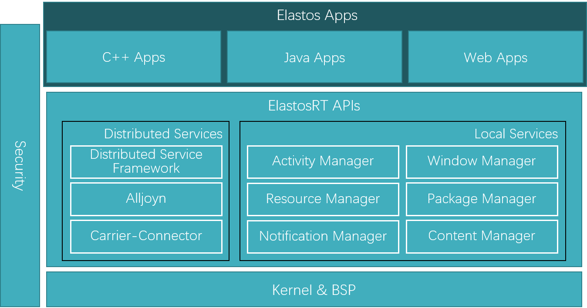

# Elastos开发指南

<span id="content"></span>
## 目录
* [前言](#preface)
* [数据类型](#datatype)
    * [基本数据类型](#basicdatatype)
    * [String类型](#string)
    * [ArrayOf类型](#arrayof)
    * [接口](#interfacetype)
* [命名空间](#namespace)
* [引用计数](#referencecount)
    * [AutoPtr](#autoptr)
    * [弱引用](#weakreference)
* [容器](#container)
    * [ETL模板类](#etl)
    * [容器类](#utility)
* [接口](#interface)
    * [方法重载](#override)
    * [方法签名](#methodsignature)
    * [命名约束](#namingrule)
    * [返回类型](#returntype)
    * [IInterface接口](#iinterface)
    * [接口间继承](#inheritinterface)
    * [local与parcelable属性](#localandparcelable)
* [类与对象](#classandobject)
    * [CAR类与C++类](#carclassandc++class)
    * [类成员声明及定义](#declareanddefine)
    * [CAR类构造方法](#carclassconstructor)
    * [Object类](#objectclass)
    * [Object锁](#objectlock)
    * [实现ICloneable接口](#implementicloneable)
* [循环引用场景](#referencecycle)
* [异常](#exception)
* [线程](#thread)
    * [Runnable类与HandlerRunnable类](#runnableandhandlerrunnable)
* [消息](#message)
* [预定义宏](#macros)
* [编译](#compile)
    * [生成文件](#filegeneration)
    * [子模块编译](#submodulecompile)
* [符号导出](#symbolexport)
* [调试](#debug)
    * [定位crash](#locatecrash)
    * [定位内存泄漏](#locatememoryleak)
* [sources文件](#sources)
    * [ELASTOS_LIBS变量](#elastoslibs)
    * [LIBRARIES变量](#libraries)
* [其它](#others)
* [范例](#example)

<span id="preface"></span>
## 前言
Elastos是面向智能终端的通用操作系统，基于Android的开放资源，采用CAR构件技术开发。Elastos操作系统具有类似WinRT(Windows Runtime)的系统架构，以一致的应用模型支持C++、Java以及JavaScript应用开发。Elastos的系统架构如下图所示。


本文档并不包括对CAR构件技术的完整介绍，文档所涉及CAR的内容是对在开发Elastos过程中对CAR构件技术所做的改进的论述，是对 __《CAR构件与编程模型技术文档》__ 的修改和补充。

本文档使用 [Markdown](http://wowubuntu.com/markdown/) 编写而成。

<span id="datatype"></span>
## 数据类型
这里讨论的是CAR数据类型，既是可以在.car中使用的数据类型。

CAR数据类型包括基本数据类型、结构体类型(struct)、ArrayOf类型、EMuid类型、EGuid类型、String类型以及接口类型。具体类型定义如下表所示。

| 类型                            | 说明                        |
|:------------------------------:|:--------------------------:|
| Char32                         | 32位字符型                   |
| Boolean                        | 布尔型                       |
| Byte                           | 无符号字节型                  |
| Int8                           | 8位有符号整型                 |
| Int16                          | 16位有符号整型                |
| Int32                          | 32位有符号整型                |
| Int64                          | 64位有符号整型                |
| UInt16                         | 16位无符号整型                |
| UInt32                         | 32位无符号整型                |
| UInt64                         | 64位无符号整型                |
| Float                          | 单精度浮点型                  |
| Double                         | 双精度浮点型                  |
| ECode                          | 返回值类型                    |
| EMuid                          | 128位UUID                   |
| EGuid                          | 128位UUID+UUNM              |
| String                         | 字符串类型                    |
| ArrayOf                        | 数组类型                     |
| PVoid                          | void*类型                    |
| enum xxx                       | 枚举类型                     |
| interface Ixxx                 | 接口类型                     |

<span id="basicdatatype"></span>
### 基本数据类型
CAR使用Char32为字符类型，它能够表示所有的UNICODE字符。C/C++、Java的char类型可以方便的显式转换为Char32类型。

为了兼容已有的程序，Elastos的C++代码保留16位的字符型Char16，并提供Char16数组与Char32数组之间的转换。

枚举成员的名字均为大写，并以该枚举的名字大写为前缀，若名字中包含多个单词，请用下划线连接起来。例如<code>BitmapConfig_ALPHA_8</code>。

<span id="string"></span>
### String类型
CAR使用String类型表示字符串。String类型采用UTF-8编码方式，使用堆内存存储所表示的字符串内容，并支持引用计数来管理自身的生命周期。

<span id="ArrayOf"></span>
### ArrayOf类型
ArrayOf实现了类似数组的功能，即在一块连续的内存中存储若干个元素。并且，如果将CAR对象指针、继承自 __Object__ 或者 __ElLightRefBase__ 类的对象指针以及String对象作为ArrayOf的元素，那么调用其<code>Set(Int32 index, T const other)</code>方法设置元素时，ArrayOf能对它们进行自动化引用计数管理，但是，通过下标<code>__[]__</code>操作进行赋值并不会自动进行引用计数管理。

对于适用于<code>AutoPtr<T></code>的类型T，该类型的指针可以直接作为ArrayOf的元素类型，即使用<code>ArrayOf<T*></code>的形式，而非<code>ArrayOf< AutoPtr<T> ></code>的形式。

ArrayOf创建时会调用<code>memset</code>将分配到的内存清零，并且自身也实现了引用计数。其引用计数增减规则说明如下：

* 创建操作(<code>__Alloc()/Clone()__</code>)：
创建或克隆一个新对象，新对象的引用计数为 0，返回的新对象需要加入AutoPtr自动释放或手动调用<code>Free()/Release()</code>释放。

* 减少引用计数操作(<code>__Free()/Release()__</code>)：
<code>Free()/Release()</code>这两个方法等价，为保证一致性推荐使用<code>Release()</code>，或加入AutoPtr由其在内部调用<code>Release()</code>自动减少引用计数。

* 增加引用计数(<code>__AddRef()__</code>)：
将一个ArrayOf指针赋值给一个AutoPtr变量时，后者将在内部调用<code>AddRef()</code>增加引用计数。如果需要手动增加引用计数，请使用宏<code>INTERFACE_ADDREF()</code>。

ArrayOf支持分配0个元素，即调用<code>ArrayOf<T>::Alloc(0)</code>，此时，针对返回的ArrayOf对象，调用其<code>GetLength()</code>方法将获得0。

ArrayOf的几种典型用法如下：

* 一般场景

    ``` cpp
    // ThreadGroup.cpp
    AutoPtr<ArrayOf<IThread *> > newThreads;
    newThreads = ArrayOf<IThread *>::Alloc(mNumThreads * 2);
    newThreads->Copy(mChildrenThreads, 0, mNumThreads);
    newThreads->Set(mNumThreads++, thread);
    mChildrenThreads = newThreads;
    ```

* 作为CAR方法的 __out, callee__ 参数

    ``` cpp
    // IPackageInfo.car
    interface IPackageInfo {
        GetActivities(
            [out, callee] ArrayOf<IActivityInfo*>* activities);
    }

    // CPackageInfo.h
    CarClass(CPackageInfo)
    {
        CARAPI GetActivities(
            /* [out, callee] */ ArrayOf<IActivityInfo*>** activities);
    }

    // CPackageInfo.cpp
    ECode CPackageInfo::GetActivities(
        /* [out, callee] */ ArrayOf<IActivityInfo*>** activities)
    {
        VALIDATE_NOT_NULL(activities);
        *activities = mActivities;
        INTERFACE_ADDREF(*activities);
        return NOERROR;
    }

    // 调用方
    AutoPtr<IPackageInfo> info;
    ...
    AutoPtr< ArrayOf<IActivityInfo*> > activities;
    info->GetActivities((ArrayOf<IActivityInfo*> **)&activities);
    ```

* 作为C++方法返回值

    ``` cpp
    // CHardwareCamera.h
    AutoPtr< ArrayOf<IInteger32*> > SplitInt(
        /* [in] */ const String& str);
    ```

对于 __双重数组__，请使用<code>AutoPtr< ArrayOf< AutoPtr< ArrayOf<T> > > ></code>形式。为了简化代码的编写，可以参考以下两种方法(实现在 __elquintent.h__ 文件中)：

* 使用模板类。该方法通用性好，但可读性欠佳。

    ``` cpp
    // 定义：elquintent.h
    template <typename T> class ArrayOf2 {
    public:
        typedef AutoPtr<ArrayOf<T> > ElementType;
        typedef ArrayOf<ElementType> Type;
    }
    ```

* 使用在 __elquintent.h__ 文件中通过 __typedef__ 预定义的类型。该方法可读性好，但不能通用。

    ``` cpp
    // 定义：elquintent.h
    typedef AutoPtr<ArrayOf<Byte> >     ByteArray;
    typedef AutoPtr<ArrayOf<Char32> >   Char32Array;
    typedef AutoPtr<ArrayOf<String> >   StringArray;
    typedef AutoPtr<ArrayOf<Int32> >    Int32Array;
    typedef AutoPtr<ArrayOf<Int64> >    Int64Array;
    typedef AutoPtr<ArrayOf<Float> >    FloatArray;
    typedef AutoPtr<ArrayOf<Double> >   DoubleArray;

    // 使用：View.h
    static const AutoPtr<ArrayOf<Int32Array> > VIEW_STATE_SETS;
    ```

<span id="interfacetype"></span>
### 接口
接口具有引用计数功能，应当通过引用计数或者借助 __AutoPtr__ 来管理接口的生命周期。

<span id="namespace"></span>
## 命名空间
CAR支持命名空间以减少命名冲突。

反射操作时使用的名称应当是包含命名空间的全名。例如， __Elastos.Core.IThread__ 接口的全名是 __LElastos/Core/IThread__ 。

<span id="referencecount"></span>
## 引用计数
CAR数据类型中支持引用计数的类型包括String类型、ArrayOf类型、接口类型。另外，下文将要介绍的ETL模板类也支持引用计数。

对于用户自己实现的类，可以通过继承 __Object__ 或者 __ElLightRefBase__ 类增加引用计数功能。

<span id="autoptr"></span>
### AutoPtr
为简化类型的引用计数操作以及保证引用计数操作的正确性，推荐使用智能指针 __AutoPtr__。并且，<code>AutoPtr<...></code>变量不必显式的赋NULL值。

对于需要返回接口指针或者对象指针的方法，建议使用 __AutoPtr__ 作为返回值，而不是直接返回裸指针。例如：

``` cpp
// CSoftKeyboardView.h
AutoPtr<ISoftKeyboard> GetSoftKeyboard();
```

并且，当调用返回AutoPtr的方法时，为避免返回的指针所指的对象被提前释放，需使用AutoPtr类型变量(而不是裸指针变量)接收返回值。例如以下程序存在隐患，<code>SoftKeyboardView::GetSoftKeyboard()</code>返回的接口可能在接下来调用<code>INTERFACE_ADDREF(*keyboard)</code>前被释放。

``` cpp
ECode CSoftKeyboardView::GetSoftKeyboard(
    /* [out] */ ISoftKeyboard** keyboard)
{
    VALIDATE_NOT_NULL(keyboard);
    *keyboard = SoftKeyboardView::GetSoftKeyboard();
    // return ptr may be released already!
    INTERFACE_ADDREF(*keyboard);
    return NOERROR;
}
```

正确的实现如下：

``` cpp
// CSoftKeyboardView.cpp
ECode CSoftKeyboardView::GetSoftKeyboard(
    /* [out] */ ISoftKeyboard** keyboard)
{
    VALIDATE_NOT_NULL(keyboard);
    AutoPtr<ISoftKeyboard> temp = SoftKeyboardView::GetSoftKeyboard();
    *keyboard = temp;
    INTERFACE_ADDREF(*keyboard);
    return NOERROR;
}
```

在循环中使用同一个AutoPtr变量多次接收方法的out参数时需要小心引用计数泄漏问题。例如，下面的程序中，当obj再次从<code>GetObject</code>中获取接口时，其前一次指向的接口的引用计数就少减了一次造成了泄漏。

``` cpp
AutoPtr<IInterface> obj;
while (...) {
    GetObject((IInterface**)&obj); // memory leak!
    ...
}
```

正确的处理方式是在调用<code>GetObject</code>前显式的调用<code>obj = NULL;</code> 以清除上一次存储的内容，如下：

``` cpp
AutoPtr<IInterface> obj;
while (...) {
    obj = NULL;
    GetObject((IInterface**)&obj);
    ...
}
```

或者将变量定义在循环体内，如下：

``` cpp
while (...) {
    AutoPtr<IInterface> obj;
    GetObject((IInterface**)&obj);
    ...
}
```

<span id="weakreference"></span>
### 弱引用
为了避免引用计数技术存在的循环引用问题，CAR将引用区分为强引用和弱引用两种方式(具体实现可参考 __elrefbase.h/elrefbase.cpp__ 文件)。

对象的弱引用对外表现为 __IWeakReference__ 接口，该接口也可以加入AutoPtr。若要获取对象的弱引用，可以通过调用该对象 __IWeakReferenceSource__ 接口的<code>GetWeakReference</code>方法。

获得对象的弱引用后，当要调用该对象某个接口的方法时，可以通过调用 __IWeakReference__ 接口的<code>Resolve()</code>方法获取想要的接口。如果该对象没有被释放，则返回非NULL，否则返回NULL。

示例程序如下：

* 获取obj的弱引用
``` cpp
AutoPtr<IWeakReference> wr;
IWeakReferenceSource::Probe(obj)->GetWeakReference((IWeakReference**)&wr);
```

* 从弱引用wr中获取实际接口
``` cpp
AutoPtr<IXXX> obj;
wr->Resolve(EIID_IXXX, (IInterface**)&obj);
```

当在项目的 __sources__ 文件里增加以下编译参数时，CAR编译器将为生成的CAR类增加弱引用功能：

```
CAR_FLAGS += -n -u
LUBE_FLAGS += -n -u
```

对于用户自定义的C++类，可以通过继承 __Object__ 类增加弱引用功能。

<span id="container"></span>
## 容器
Elastos具有两种采用不同实现方式的容器，一种采用模板的方式实现(称为ETL，Elastos Template Library)，另一种采用CAR类的方式实现(称为容器类)。

<span id="etl"></span>
### ETL模板类
ETL是基于SGI实现的一套C++模版库，它的使用方法与STL相似。

使用ETL中的模板类时需要包含 __coredef.h__ 头文件(开发Libcore下的程序)或 __frameworkdef.h__ 头文件(开发Framework下的程序或应用)。

ETL中的模板类也具有引用计数，因此可以使用AutoPtr来管理模板实例化后的类。但是，模板类并不会自动修改其元素的引用计数(与STL的行为一致)。因此，若要实现元素引用计数的自动管理，可以考虑将元素用AutoPtr包装。

以下是使用模板时需要注意的几点问题：

1. 遍历过程中如何修改迭代器。
    要特别注意在使用 __Iterator__ 或者 __ReverseIterator__ 遍历的过程中修改迭代器的情况，常见的情形是遍历过程中调用<code>Erase()</code>方法修改迭代器使得当前迭代器失效（请参考[Effective STL](http://book.douban.com/subject/1243751/)）。

    下面将介绍各种容器分别在正向和反向遍历过程中调用<code>Erase()</code>方法的正确方式。

    * 对于正向迭代器Iterator来说，List和HashMap各有不同。
        List的<code>Erase()</code>方法返回下一个迭代器，所以使用<code>it = Erase(it);</code>方式即可。而HashMap的<code>Erase()</code>方法返回void，所以需要生成当前迭代器的副本，然后递增当前迭代器，再Erase副本，这个顺序一定不能错。又因为HashMap重载的后缀++操作符是先创建副本，然后递增迭代器，然后返回副本，所以可以使用<code>map.Erase(mit++);</code>方式。

        List使用示例如下:

        ``` cpp
        List<Int32>::Iterator it;
        for (it = list.Begin(); it != list.End();) {
            if (0 == (*it)%2) {
                it = list.Erase(it);
            }
            else {
                ++it;
            }
        }
        ```

        HashMap使用示例如下:

        ``` cpp
        HashMap<Int32, Int32>::Iterator mit;
        for (mit = map.Begin(); mit != map.End();) {
            if (0 == mit->mFirst % 2) {
                map.Erase(mit++);
            }
            else {
                ++mit;
            }
        }
        ```

        这方面，Vector的用法与List相同。

    * 对于反向迭代器，HashMap没有反向迭代器，就只有List一种情形。
        由于反向迭代器是由后往前和正向迭代器相差一个元素，而<code>Erase()</code>方法只接收正向迭代器，因此需要将反向迭代器转换为正向迭代器。首先需要调用<code>--(rit.GetBase());</code>获得需要删除元素的正向迭代器，然后调用<code>Erase()</code>方法删除该元素，最后再将<code>Erase()</code>方法返回的正向迭代器包装成反向迭代器。

        List使用示例如下:

        ``` cpp
        List<Int32>::ReverseIterator rit;
        for (rit = list.RBegin(); rit != list.REnd();) {
            if (0 == (*rit) % 2) {
                rit = List<Int32>::ReverseIterator(list.Erase(--(rit.GetBase())));
            }
            else {
                ++rit;
            }
        }
        ```

        这方面，Vector的用法与List相同。

        请注意，反向迭代需使用反向迭代器，不应使用正向迭代器进行反向遍历。

2. CAR对象作为HashMap/HashSet的key
    此时，需要考虑是使用对象地址还是使用对象的hash值(通过调用<code>GetHashCode()</code>方法获得)作为key值。这需要特化<code>Hash()/EqualTo()</code>这两个模版方法。在 __frameworkhash.h__ 中针对CAR接口提供了一些便利的宏，并且通常也把其它需要特化的模板方法定义在其中。

<span id="utility"></span>
### 容器类
__Elastos::Utility__ 命名空间下包含了常用的以CAR类方式实现的容器，适合存储实现了 __IComparable__ 接口的对象。

两种容器各有利弊，ETL模板类容器操纵元素时更加便捷，而容器类的使用更加面向接口、与Java中的用法基本一致。

需要注意的是，从容器中取出元素后需要Probe出正确的接口再使用。例如下面的程序是错误的：

``` cpp
AutoPtr<IPreferenceActivityHeader> element;
mHeaders->Get(curHeader, (IInterface**)&element);
```

正确的写法为：

``` cpp
AutoPtr<IInterface> element;
mHeaders->Get(curHeader, (IInterface**)&element);
IPreferenceActivityHeader::Probe(element);
```

<span id="interface"></span>
## 接口
从功能角度看，一个接口代表了一个对象的其中一个功能面，因此，一个对象的所有功能可以通过多个接口来变现。

接口间的类型转换应当使用 __Probe__，而不能直接进行显式类型转换。

<span id="override"></span>
### 方法重载
以前，为了支持C，CAR接口方法定义不支持方法重载，必须给同名的方法加“Ex”、“Ex2”等后缀。这种处理方式有两个问题。第一，是对编程不友好，特别是在同名方法比较多的情况下。第二，是在运行Java程序时，兼容层需要根据CAR的方法转调同名的Java方法，对于加了后缀的CAR方法，我们不容易得到相应的Java方法(人为的去掉后缀在某些情况下可能行不通)。

现在，为了更好的支持Elastos开发，我们降低了对C编程的支持，为CAR接口的方法定义增加了方法重载的支持。

<span id="methodsignature"></span>
### 方法签名
因为接口方法可以重载，因此通过反射获取接口或者类中的方法需要指定方法名和 __方法签名__。

CAR方法类型签名为 __\"(\" 所有参数类型签名  \")\" 返回类型签名__ 。CAR数据类型签名规则如下表所示：

| Types                          | Signature                  |
|:------------------------------:|:--------------------------:|
| Char32                         | C32                        |
| Boolean                        | Z                          |
| Byte                           | B                          |
| Int8                           | I8                         |
| Int16                          | I16                        |
| Int32                          | I32                        |
| Int64                          | I64                        |
| UInt16                         | U16                        |
| UInt32                         | U32                        |
| UInt64                         | U64                        |
| Float                          | F                          |
| Double                         | D                          |
| ECode                          | E                          |
| EMuid                          | IID                        |
| EGuid                          | CID                        |
| String                         | LElastos/String;           |
| ArrayOf<Int32\>                | [I32                       |
| ArrayOf<String\>               | [LElastos/String;          |
| Enum Elastos.Core.ThreadState  | LElastos/Core/ThreadState; |
| interface Elastos.Core.IThread | LElastos/Core/IThread;     |

指针类型 __\" Type * \"__ 的类型签名为 __\" Type的签名* \"__ 。
指针类型 __\" Type ** \"__ 的类型签名为 __\" Type的签名** \"__ 。

以一些方法举例如下：

- 方法"CARAPI SetValue(String)"的类型签名是"(LElastos/String;)E"
- 方法"CARAPI GetValue(String\*)"的类型签名是"(LElastos/String;\*)E"
- 方法"CARAPI SetValue(Int32, String, Int64)"的类型签名是"(I32LElastos/String;I64)E"
- 方法"CARAPI GetValue(Int32\*, String\*, Int64\*)"的类型签名是"(I32\*LElastos/String;\*I64\*)E"

<span id="namingrule"></span>
### 命名约束
接口中不能出现两个方法名相同，参数个数、名称以及顺序一样，仅参数类型不同的方法。这是为了支持在动态类型语言(如JavaScript)中通过反射调用CAR方法。这一点尤其体现在CAR类构造方法 __constructor__ 上，因为构造方法名字都是相同的，只能通过采用不同的参数名字来区分。例如：

```
// Elastos/LibCore/src/Elastos/Security/Elastos.Security.car
class CPKIXBuilderParameters {
    constructor();

    constructor(
        [in] ISet* trustAnchors,
        [in] ICertSelector* targetConstraints);

    constructor(
        [in] IKeyStore* keyStore,
        [in] ICertSelector* targetConstraints);

    interface IPKIXBuilderParameters;
}
```

控件类的CAR构造方法的参数命名有特殊的规则，为了支持通过反射从xml中解析出来控件类名称创建出对应的控件，所有实现 __IView__ 或者 __IActionProvider__ 接口的CAR类的构造方法 __constructor__ 的第一个参数若为 __IContext\*__ 类型则参数名应为 __ctx__；第二个参数若为 __IAttributeSet\*__ 类型则参数名应为 __attrs__。例如：

```
// Elastos/Framework/Droid/Base/Core/car/elastos/droid/view.car
class CView {
    constructor(
        [in] IContext* ctx);

    constructor(
        [in] IContext* ctx,
        [in] IAttributeSet* attrs);

    constructor(
        [in] IContext* ctx,
        [in] IAttributeSet* attrs,
        [in] Int32 defStyle);

    constructor(
        [in] IContext* ctx,
        [in] IAttributeSet* attrs,
        [in] Int32 defStyleAttr,
        [in] Int32 defStyleRes);

    interface IView;
    interface IDrawableCallback;
    interface IKeyEventCallback;
    interface IAccessibilityEventSource;
}
```

<span id="returntype"></span>
### 返回类型
接口中方法的返回类型都是ECode，所以，如果Java方法有返回值，那么，在CAR方法中要以out参数来返回。但有一点例外，即如果Java方法返回的是this对象，那么对应的CAR方法不需要通过out参数返回相应的接口指针。原因是CAR方法不能像Java方法那样实现方法连续调用(如a->Foo()->Bar())，因此即使通过out参数返回相应的接口指针也没有意义。

例如以下Java方法：

``` java
public ViewPropertyAnimator alphaBy(float value) {
    animatePropertyBy(ALPHA, value);
    return this;
}
```

对应的CAR方法应为：

```
AlphaBy(
    [in] Float value);
```

<span id="iinterface"></span>
### IInterface接口
IInterface接口是所有接口的(直接或间接)父接口，如果在.car中定义接口时没有指定其父接口，那么CAR编译器就会默认指定IInterface接口为该接口的父接口。

由于IInterface接口是所有接口的父接口，所以一个实现了多个接口的对象有多个地址不同的IInterface接口，因此如果通过IInterface接口来进行对象判等，则判等的两个对象都需要Probe出IInterface接口再比较。对象的Equals方法中较多涉及此情景。

<span id="inheritinterface"></span>
### 接口间继承
Elastos4.2系统按照Java中类的继承关系来定义系统中接口间的继承关系。比如， __IActivity__ 接口继承 __IContextThemeWrapper__ 接口。

接口继承的好处是便于开发，通过IActivity接口就可以调用IContextThemeWrapper接口中的方法。

但接口继承也有比较大的弊端，其一是若Java代码中，一个类实现了多个接口，那么Elastos中应该继承哪个接口并没有相应的标准。

其二是会导致代码的冗余。例如，实现IActivity接口的类可以继承实现IContextThemeWrapper的类，但即使前者没有重新定义IContextThemeWrapper接口中的任何方法，仍然需要将该接口中的所有方法都封装一下，转调基类的相应方法。

因此，Elastos5.0系统取消了接口间的继承。不过，开发时不能再像以前那样通过一个接口支持所有方法，而是要Probe出相应的接口再调用。例如，IActivity接口不再继承IContextThemeWrapper接口，因此不能通过IActivity接口调用IContextThemeWrapper里的方法，而是要从IActivity接口Probe出IContextThemeWrapper接口再调用。

取消接口间的继承后，实现某个接口往往伴随着要实现其它接口。例如，实现IActivity接口的类应该也实现IContextThemeWrapper接口，而实现IContextThemeWrapper接口也应该实现IContextWrapper接口，而实现IContextWrapper接口也应该实现IContext接口。这些要同时实现的接口，在IActivity接口的声明中都无法体现出来。因此，我们规定需要在其声明的头部加上一定的注释，注明这些要同时实现的接口。注释的形式如下：

```
/**
  * @Involve
  * interface IContext;
  * interface IContextWrapper;
  * interface IContextThemeWrapper;
  */

interface IActivity {
   ...
}
```

<span id="localandparcelable"></span>
### local与parcelable属性
接口的local属性表示该接口只能被本进程调用，而无法跨进程调用。接口的parcelable属性表示该接口所代表的实体可以整体被传输(即marshal)到另一个进程里。

它们不是两个相互对立的属性，在不少情况下需组合起来使用。

<span id="classandobject"></span>
## 类与对象

<span id="carclassandc++class"></span>
### CAR类与C++类
在.car文件中声明的类称为CAR类，而只在.h文件或.cpp文件中声明或定义的类称为C++类。

Elastos5.0简化了CAR编译器生成的代码，优化了Elastos C++代码的类继承结构。因此，可以为C++类和CAR类赋予不同的职责，C++类用于实现代码逻辑，而CAR类用于封装元信息到C++类中。因此，C++类可以被C++类和CAR类继承，而CAR类不能再被C++类或CAR类继承。

Elastos5.0中CButton控件的继承关系为 __CButton-->Button-->TextView-->View-->Object__ ，而CTextView控件的继承关系为 __CTextView-->TextView-->View-->Object__ 。

对于只包含静态成员方法的类，实现时可以分成C++类和CAR类，C++类实现成静态类(方法都是静态方法)，CAR类实现成单例(singleton)类，并在CAR类的方法中转调C++类的静态方法。

<span id="declareanddefine"></span>
### 类成员声明及定义
不论是C++类还是CAR类，类成员的声明顺序做如下规定(标号顺序表明声明顺序)：

1. public修饰的内部类
2. protected修饰的内部类
3. private修饰的内部类
4. public修饰的方法
5. protected修饰的方法
6. private修饰的方法
7. public修饰的成员变量
8. protected修饰的成员变量
9. private修饰的成员变量

.cpp中类成员的定义顺序做如下规定：
* 首先是内部类的定义。
* 方法的定义顺序按照参考类的方法定义顺序，不用与声明顺序保持一致。

<span id="carclassconstructor"></span>
### CAR类构造方法
对于一个CAR类CXXX而言，它有两种构造方法，一种是C++构造方法CXXX()，另一种是CAR构造方法 __constructor()__ 。后者本质上是一个普通的C++方法。

它们的相似点是：

* 如果没有提供自定义的实现则都会提供一个默认的无参的实现。
* 都支持构造函数重载。

它们的不同点是：

* C++构造方法支持初始化列表，而CAR构造方法不支持。
* 在C++构造方法执行时，该对象还未就绪，而CAR构造方法执行时，对象已经就绪。

因此，我们可以利用C++构造方法的初始化列表初始化成员变量。

对于实现了 __IParcelble__ 接口的CAR类而言，它必须有一个无参的CAR构造方法 __constrctor()__ （无论是默认提供的，还是显式声明的），这是为了支持该对象的散集(unmarshall)。散集时，先调用该构造方法创建对象，然后再转型为IParcelble接口，调用<code>IParcelble::ReadFromParcel()</code>设置对象成员变量。因此，Elastos里规定，凡是实现了IParcelable接口的CAR类都必须显式声明一个无参的CAR构造方法。例如：

```
// Elastos/FrameworkDroid/Base/Core/car/accounts.car
class CAccount
{
    constructor();

    constructor(
        [in] String name,
        [in] String type);

    interface IAccount;
    interface IParcelable;
}
```

另外，Elastos规定对于非单例的CAR类，若该类没有显式的声明constructor，则需要显式的声明无参的constructor。

在如下结构的Java程序中，多个类之间有继承关系，并且在子类的构造方法中会调用父类的构造方法：

``` java
class A
{
public:
    A(int i, long l) {...}
}

class B extends A
{
public:
    B(int i, long l) { super(i, l); ... }
}

class C extends B
{
public:
    C(int i, long l) { super(i, l); ... }
}
```

Elastos程序中采用如下方式处理：

``` cpp
class A : public Object
{
public:
    A() {}
    CARAPI constructor(Int32 i, Int64 l) { ... }
}

class B : public A
{
public:
    B() {}
    CARAPI constructor(Int32 i, Int64 l)
    { FAIL_RETURN(A::constructor(i, l)); ... }
}

class C : public B
{
public:
    C() {}
    CARAPI constructor(Int32 i, Int64 l)
    { FAIL_RETURN(B::constructor(i, l)); ... }
}
```

<span id="objectclass"></span>
### Object类
Elastos定义了Object类，该类实现了以下功能：

* 支持引用计数管理生命周期。
* 支持弱引用，实现了IWeakReferenceSource接口。
* 实现了IObject接口，支持<code>Equals()</code>、<code>GetHashCode()</code>以及<code>ToString()</code>等方法。
* 实现了ISynchronize接口，支持<code>Lock()</code>、<code>Unlock()</code>、<code>Wait()</code>以及<code>Notify()</code>等方法。

当编写一个C++类(全部成员是静态成员的类除外)或者CAR类时，请将Object类作为其基类，可以直接或者间接继承Object。Object的子类可以按需重载<code>Equals()</code>、<code>GetHashCode()</code>以及<code>ToString()</code>方法，CAR类还需重载<code>GetClassID()</code>方法。

为方便调试，子类需重视<code>ToString()</code>方法的实现。一般的，<code>ToString()</code>方法返回该对象所属类的类名。对于CAR类，Object基类的<code>ToString()</code>方法可以通过反射获取类名，因此，如无其它需求，CAR类无需重载该方法。而C++类请 __重载__ 该方法，在实现中返回类名。

所有CAR类都默认实现了IObject、ISynchronize和IWeakReferenceSource接口，在.car文件中声明CAR类时，不用显式的声明这些接口，它们将由CAR编译器自动加入到CAR类实现的接口中去。

<span id="objectlock"></span>
### Object锁
__Elastos.Core.Mutex__ 是对pthread_mutex_t的封装，且被初始化为重入检查锁。重入检查锁不是递归锁，虽然它支持同一个线程多次调用lock而不会死锁，但是不论调用几次lock，只要调用一次unlock就会解锁。所以，它并不适用于递归调用的情况。而相应递归锁的运行效率并不理想。

Object类实现了 __ISynchronize__ 接口，具有锁的功能，支持递归调用，并且运行效率比pthread的递归锁高。C++类和CAR类继承Object类以后，自身都具备了锁的功能，因此，推荐在程序中使用对象自身的锁，并可以结合 __Elastos.Core.AutoLock__ 使用。

另外，__ISynchronize__ 接口还实现了<code>Wait()</code>、<code>Notify()</code>以及<code>NotifyAll()</code>的功能。

<span id="implementicloneable"></span>
### 实现ICloneable接口
__ICloneable__ 接口的实现需要特殊处理，由于Java程序中子类通常会调用父类的<code>Clone()</code>来克隆父类的成员。在Elastos程序中，我们可以使用如下机制来实现：

``` cpp
    // Locale.h
    public:
    // 覆写 ICloneable 接口
    CARAPI Clone(
        /* [out] */ IInterface** newObj);

    protected:
    // 供自身以及子类调用
    CARAPI CloneImpl(
        /* [in] */ ILocale* locale);

    // Locale.cpp
    ECode Locale::Clone(
        /* [out] */ IInterface** newObj)
    {
        VALIDATE_NOT_NULL(newObj);
        // 调用适当的构造函数创建对象（通常是无参数的那一个）
        AutoPtr<ILocale> locale;
        CLocale::New((ILocale**)&locale);

        // 调用自身的 CloneImpl
        CloneImpl(locale);

        // 返回接口指针
        *newObj = locale->Probe(EIID_IInterface);
        REFCOUNT_ADD(*newObj);
        return NOERROR;
    }

    ECode Locale::CloneImpl(
        /* [in] */ ILocale* locale)
    {
        assert(locale);

        // 若有父类，调用直接父类的 CloneImpl
        // CloneImpl(IParent::Probe(locale);

        CLocale* l = (CLocale*)locale;
        l->mCountryCode = mCountryCode;
        l->mLanguageCode = mLanguageCode;
        l->mVariantCode = mVariantCode;
        l->mScriptCode = mScriptCode;

        l->mUnicodeAttributes = mUnicodeAttributes;
        l->mUnicodeKeywords = mUnicodeKeywords;
        l->mExtensions = mExtensions;

        l->mHasValidatedFields = mHasValidatedFields;

        l->mCachedToStringResult = mCachedToStringResult;
        l->mCachedLanguageTag = mCachedLanguageTag;
        l->mCachedIcuLocaleId = mCachedIcuLocaleId;
        return NOERROR;
    }
```

<span id="referencecycle"></span>
### 循环引用场景
程序中容易导致对象间循环引用产生的场景包括以下几种：

* 内部类与外部类之间。
* 下例程序结构很可能存在循环引用(A与mView之间)：

    ``` cpp
    class A : IOnClickListener
    {
    public:
        CARAPI Func()
        {
            mView->SetListener(this);
        }

    private:
        AutoPtr<IView> mView;
    }
    ```

    针对这种情况，可以采用如下方法解除循环引用：

    ``` cpp
    class A : IOnClickListener
    {
    public:
        class Wrapper : IOnClickListener
        {
        private:
            A* mHost;
        };

    public:
        CARAPI Func()
        {
            mView->SetListener(mWrapper);
        }

    private:
        AutoPtr<IView> mView;
        AutoPtr<Wrapper> mWrapper;
    }
    ```

<span id="exception"></span>
## 异常
Elastos程序并没有启用C++异常机制，而是用ECode来表示方法执行过程中出现的各种异常情况。所以，Android中的Java异常应该转换成Elastos中预定义的ECode值。

Libcore和Framework模块有各自的exception和error值的定义(Exceptions.car和Errors.car)，对于新的需要转换的Java异常，请按照相应的规则添加到每个模块各自的定义文件中。

<span id="thread"></span>
## 线程

<span id="runnableandhandlerrunnable"></span>
### Runnable类与HandlerRunnable类
__Elastos::Droid::Os::Runnable__ 封装了IRunnable接口，可作为需实现IRunnable接口的类的基类以简化开发。

同样的，__Elastos::Droid::Os::HandlerRunnable__ 可作为需同时实现IHandler与IRunnable接口的类的基类。

<span id="message"></span>
## 消息

<span id="macros"></span>
## 预定义宏
Elastos预定义了若干宏以方便开发，说明如下：

* __REFCOUNT_ADD__ 引用计数加一，__REFCOUNT_RELEASE__ 引用计数减一。
* __CAR_INTERFACE_DECL__ 声明接口的四个基本方法，__CAR_INTERFACE_IMPL__ 及 __CAR_INTERFACE_IMPL_N__ 定义接口的四个基本方法，接口实现类(C++类或CAR类)可使用它们。
* __CAR_OBJECT_DECL__ 声明非单例的CAR类的基本方法，__CAR_OBJECT_IMPL__ 定义非单例的CAR类的基本方法，非单例的CAR类可使用它们。
* __CAR_SINGLETON_DECL__ 声明单例CAR类的基本方法，__CAR_SINGLETON_IMPL__ 定义单例CAR类的基本方法，单例的CAR类可使用它们。

<span id="compile"></span>
## 编译

<span id="filegeneration"></span>
### 生成文件
后台生成的文件名包含命名空间前缀，如CBoolean类的生成文件名为 __\_Elastos_Core_CBoolean.h__ 。

<span id="submodulecompile"></span>
### 子模块编译
LibCore模块将编译成 __Elastos.CoreLibrary.eco__ ，该eco合并了目录下的子模块编译生成的lib。

以core目录为例，编译其中的子模块的方法如下：

1.加入编译路径：在Elastos5/Sources/Elastos/LibCore/inc/elastos/dirs中加入要编译的子目录，如core：

```
DIRS = core
#DIRS += math
```

为支持并行编译，需在Elastos5/Build/Tools/arm-android-paralist文件中加入：

```
Elastos/LibCore/src/elastos/core
```

2.在子目录中添加sources文件(Elastos5/Sources/Elastos/LibCore/src/elastos/core/soruces)如下，以设置编译参数与编译：

```
TARGET_NAME= elastos.core
TARGET_TYPE= lib

C_DEFINES += -DELASTOS_CORELIBRARY

include $(MAKEDIR)/../../sources.inc

INCLUDES += $(PREBUILD_INC)/sys;
INCLUDES += ../
INCLUDES += $(MAKEDIR)/../../../inc/elastos;
INCLUDES += $(MAKEDIR)/../../../inc/elastos/core;

SOURCES += Thread.cpp
SOURCES += NativeThread.cpp
SOURCES += Object.cpp
SOURCES += Singleton.cpp
```

3.将子模块编译结果合并到模块eco中，在Elastos5/Sources/Elastos/LibCore/src/corelibrary/sources中添加如下两行：

```
INCLUDES += $(MAKEDIR)/../../inc/elastos/core
...
ELASTOS_LIBS += ../elastos/core/elastos.core.lib
```

4.添加子模块CAR类声明文件，生成Elastos5/Sources/Elastos/LibCore/car/elastos/core.car，并将其合并到Elastos5/Sources/Elastos/LibCore/src/corelibrary/Elastos.CoreLibrary.car中：

```
merge("../../car/elastos/core.car");
```

<span id="symbolexport"></span>
## 符号导出
Elastos有两种方式规定要导出的符号，第一种方式是通过 __.def__ 文件，第二种方式是通过宏 __ECO_PUBLIC__ 和 __ECO_PRIVATE__ 。第一种导出方式的优先级更高，也就是说，只要有.def文件，就只会导出该文件中定义的符号。

第一种导出方式比较简单，只需要增加一个与eco同名的.def文件(例如，如果eco是Elastos.CoreLibrary.eco，那么.def文件叫做Elastos.CoreLibrary.def)。然后在该.def文件中加入需要导出的符号即可，具体格式可参考elastos.def。

第二种导出方式更加简单，只需要在要导出的类名、方法名或静态成员变量名前加宏 __ECO_PUBLIC__ 即可。但有一点需要注意，如果在类名前加 __ECO_PUBLIC__ ，那么默认情况下会把该类的所有符号导出，包括私有的内部类、成员方法和成员变量。为了限制这些私有成员的导出，我们可以在它们前面加宏 __ECO_PRIVATE__ 。

第一种方式被Elastos.Runtime.eco采用，而其它eco基本都采用第二种方式。

<span id="debug"></span>
## 调试

<span id="locatecrash"></span>
### 定位crash
.eco支持根据程序crash时logcat中显示的调用栈信息定位到源码中的具体位置。

当程序crash时，logcat会打印出进程的crash信息，其中 __backtrace__ 栏目下会包含当时的调用栈，例如：

``` html
backtrace:
I/DEBUG   ( 1218):     #01  pc 013624a4  /system/lib/Elastos.Droid.Core.eco
I/DEBUG   ( 1218):     #02  pc 0134e328  /system/lib/Elastos.Droid.Core.eco
I/DEBUG   ( 1218):     #03  pc 0134e49c  /system/lib/Elastos.Droid.Core.eco
...
```

其中， __pc__ 后的32位十六进制数就是出错时正执行的程序地址。可以通过 __arm-linux-androideabi-addr2line__ 工具将地址转换成可读的源代码位置信息。具体方法是在编译环境中执行<code>pd @</code>，再执行<code>cd debug_info</code>，然后执行：

```
arm-linux-androideabi-addr2line –e XXX.eco crash-address
```

针对例子中的地址执行：

```
arm-linux-androideabi-addr2line -e Elastos.Droid.Core.eco 013624a4
```

会得到以下结果:

```
/home/xxx/Elastos5/Targets/obj/rdk/arm.gnu.android.dbg/inc/elautoptr.h:112
```

另外，Elastos工具链也提供了一个脚本用于将多个地址信息批量转换为源代码位置信息。使用方法是在编译环境中切换到Elastos5/DevDoc/DbgTools目录下，将crash信息按照如下格式

```
I/DEBUG   ( 1218):     #01  pc 013624a4  /system/lib/Elastos.Droid.Core.eco
I/DEBUG   ( 1218):     #02  pc 0134e328  /system/lib/Elastos.Droid.Core.eco
I/DEBUG   ( 1218):     #03  pc 0134e49c  /system/lib/Elastos.Droid.Core.eco
```

拷贝到目录下的 __crashinfo__ 文件中，然后执行<code>addr2line_dbg.sh crashinfo</code>，就能在编译环境中以及crashinfo文件里同时得到相应的多个源代码位置信息。

<span id="locatememoryleak"></span>
### 定位内存泄漏
定位Elastos程序内存泄漏的方法如下：

1.将如下代码放到需要重复运行以便排查内存泄漏的地方：

``` cpp
#include "os/CDebug.h"

using Elastos::Droid::Os::IDebug;
using Elastos::Droid::Os::CDebug;
using Elastos::IO::IFile;
using Elastos::IO::CFile;
using Elastos::IO::IFileDescriptor;
using Elastos::IO::CFileDescriptor;
using Libcore::IO::IOsConstants;
using Libcore::IO::COsConstants;
using Libcore::IO::ILibcore;
using Libcore::IO::CLibcore;
using Libcore::IO::IOs;
using Libcore::IO::IIoBridge;
using Libcore::IO::CIoBridge;

static void MyDumpMemery()
{
    AutoPtr<IOsConstants> osConstans;
    COsConstants::AcquireSingleton((IOsConstants**)&osConstans);
    Int32 m1, m2, m3;
    osConstans->GetOsConstant(String("O_RDWR"), &m1);
    osConstans->GetOsConstant(String("O_CREAT"), &m2);
    osConstans->GetOsConstant(String("O_TRUNC"), &m3);

    AutoPtr<IFile> file;
    CFile::New(String("/data/debug"), (IFile**)&file);
    Boolean bval;
    file->Exists(&bval);
    if (!bval) {
        file->Mkdirs(&bval);
    }

    AutoPtr<IFileDescriptor> ifd;
    CFileDescriptor::New((IFileDescriptor**)&ifd);
    AutoPtr<IIoBridge> ioBridge;
    CIoBridge::AcquireSingleton((IIoBridge**)&ioBridge);
    Int32 fd;
    ioBridge->Open(String("/data/debug/1.txt"), m1 | m2 | m3, &fd);
    ifd->SetDescriptor(fd);

    AutoPtr<IDebug> dbg;
    CDebug::AcquireSingleton((IDebug**)&dbg);
    dbg->DumpHeap(ifd);
}
```

2.进入shell环境，执行<code>chmod 777 /data/debug</code>赋予/data/debug写权限，然后启用内存调试开关：

``` shell
adb shell setprop libc.debug.malloc 1
adb shell stop
adb shell start
```

3.杀死要调试的进程，让其自动重启。

4.运行几次目标程序，将当前的内存信息保存下来，

``` shell
adb pull /data/debug/1.txt 1.txt
```

5.再次运行几次目标程序，将当前的内存信息保存下来

``` shell
adb pull /data/debug/1.txt 1.txt
```

6.使用文本比较工具，生成内存信息变动情况diff.txt，将diff.txt放到/data/debug目录下。

7.编译DevSample下面的MemoryDummper，将MemoryDummper放到/data/debug目录下，运行 shell命令<code>clear</code>清屏，然后运行<code>./MemoryDummper 要调试的进程id</code>。

8.将shell输出结果拷贝到result.txt，运行<code> MemDumpFormatter result.txt addr2line.txt</code>，分析生成的addr2line.txt中的源代码位置信息。

为了调试方便，针对以上步骤制作了一个脚本: [loc_memleak](), 使用时需注意以下几点：

* 脚本可以通过`./loc_memleak.sh -h`查看帮助。
* 使用`./loc_memleak.sh -p`开启内存调试开关。
* 一般情况下，使用`./loc_memleak.sh -all`进行整体运行。在运行过程中，会出现用户交互。
    * `Please run the target program, and then start the task(yes or no):` 表示执行脚本后，需要运行一个目标程序，然后输入`yes`。
    * `Please input the target program's NAME(such as: SystemUI PinyinIME):` 表示需要输入一个调试进程的名称，目的是获取该进程的id。
    * `Please run multiple times the target program, and then start the task(yes or no):` 再次运行几次目标程序，输入`yes`。
    * 脚本会将最后的结果输出到屏幕中，并且保存到一个文件中。
* 脚本生成的文件：
    * `first.txt` 为首次运行目标程序生成的内存信息。
    * `second.txt` 为再次运行多次目标程序生成的内存信息。
    * `diff.txt` 为内存信息变动情况的文件。
    * `logcat.txt` 为开发板运行“MemoryDummper”生成的文件, 同时也是“MemDumpFormatter.exe”的输入文件。
    * `addr2line.txt` 为定位文件。
    * `result.txt` 为最终有可能内存泄露的源码位置信息。

<span id="sources"></span>
## sources文件

<span id="elastoslibs"></span>
### ELASTOS_LIBS变量
该变量用于指定链接到eco中的lib库，与LIBRARIES变量不同的是，该变量指定的lib库中的所有资源都将链接到eco中，而不是按需链入。

<span id="libraries"></span>
### LIBRARIES变量
该变量用于指定链接到eco中的lib库，与ELASTOS_LIBS变量不同的是，该变量指定的lib库中的资源将按需链接到eco中，而不是所有资源都链入。

<span id="others"></span>
## 其它
* 包含头文件和通过using导入名字的顺序是先写framework中的再写corelibrary中的，并且对于每个的内部按照字母序排列。例如Intent.h中的顺序如下：

    ```cpp
    #include "Elastos.Droid.Content.h"
    #include <elastos/core/StringBuilder.h>
    #include <elastos/utility/etl/HashSet.h>

    using Elastos::Droid::Net::IUri;
    using Elastos::Droid::Os::IBinder;
    using Elastos::Droid::Os::IBundle;
    using Elastos::Droid::Graphics::IRect;
    using Elastos::Droid::Content::IIntent;
    using Elastos::Droid::Content::Pm::IPackageManager;
    using Elastos::Droid::Content::Pm::IActivityInfo;
    using Elastos::Droid::Content::Res::IResources;
    using Elastos::Droid::Utility::IAttributeSet;

    using Elastos::Core::StringBuilder;
    using Elastos::Core::ICharSequence;
    using Elastos::Core::IStringBuilder;
    using Elastos::Core::IClassLoader;
    using Elastos::Core::ICloneable;
    using Elastos::Utility::IArrayList;
    using Elastos::Utility::Etl::HashSet;
    using Org::Xmlpull::V1::IXmlPullParser;
    using Org::Xmlpull::V1::IXmlSerializer;
    ```

* 用接口类型的输入参数去接收out参数是错的，当输入参数值不为NULL时会导致其原先指向的接口的引用计数泄漏，正确的做法是定义新的局部变量接收输入参数。例如：

    ``` cpp
    ECode CXXX::RegisterCallback(
        /* [in] */ IXXXCallback* callback,
        /* [in] */ IHandler* _handler)
    {
        AutoPtr<IHandler> hander = _handler;_
        if (callback == NULL) {
            return E_ILLEGAL_ARGUMENT_EXCEPTION;
        }
        if (handler == NULL) {
            CHandler::New((IHandler**)&handler);
        }
        synchronized (mLock) {
            AddCallbackLocked(callback, handler);
        }
        return NOERROR;
    }
    ```

* 有些Java类本身有<code>Release()</code>方法，需改名以免与接口的<code>Release()</code>方法混淆导致程序错误。

* Java中继承Stub的类因为要支持跨进程调用，所以Elastos中需要实现成CAR类。例如：

    ``` java
    public final class AccessibilityInteractionClient
            extends IAccessibilityInteractionConnectionCallback.Stub
    {
        ...
    }
    ```

* Java中静态成员变量初始化与static{...}执行的顺序是按照它们声明的顺序。例如，下例中，sObj1、sObj2以及static块的执行顺序是sObj1、static块、sObj2。转译成Elastos程序时需注意它们的执行顺序一致。

    ``` java
    class A
    {
    public:
        static Object sObj1 = new Object();
        static {
            ...
        }
        static Object sObj2 = new Object();
    };
    ```

<span id="example"></span>
## 范例
范例 __HelloCar__ 说明了如何编写带有继承结构的CAR类以及如何编写单例类(代码路径为ElastosRDK5_0/Sources/Elastos/LibCore/tests/HelloCar):

    + HelloCar
        + eco
            + elastos
                + hellocar
                    - Animal.cpp
                    - CAnimalHelper.cpp
                    - CMyThread.cpp
                    - Cat.cpp
                    - Dog.cpp
                    - Elastos.HelloCar.car
                    - IAnimal.car
                    - IDlog.car
                    - helloCar.cpp
                    - sources
                - dirs
            + inc
                + elastos
                    + hellocar
                        - Animal.h
                        - CAnimalHelper.h
                        - CCat.h
                        - CDog.h
                        - CMyThread.h
                        - Cat.h
                        - Dog.h
            - dirs
        - dirs
        - main.cpp
        - sources

HelloCar包括两个部分：Elastos.HelloCar.eco和使用这个eco的可执行程序，请阅读代码与注释了解细节。下面将讲解一下其中的要点。

* HelloCar/eco/elastos/hellocar/IDog.car

``` cpp
module
{

    namespace Elastos {
    namespace HelloCar {

        // 基类注释说明 IDog extends IAnimal
        /**
         * @Involve
         * interface IAnimal;
         */
        interface IDog {
            Bark();
        }

    } // HelloCar
    } // Elastos
}
```

* C++基类：HelloCar/eco/inc/elastos/hellocar/Animal.h

``` cpp
#ifndef __HELLOCAR_ANIMAL_H__
#define __HELLOCAR_ANIMAL_H__

#include <_Elastos.HelloCar.h>    // include 模块头文件，文件名格式：模块名称_server.h
#include <elastos/core/Object.h>  // include Object 基类

using Elastos::Core::IComparable;

namespace Elastos {
namespace HelloCar {

// C++ 类　Animal 作为 CCat，CDog 的基类，实现了 IAnimal 接口，并继承自基类 Object
class Animal
    : public Object
    , public IAnimal
    , public IComparable
{
public:
    CAR_INTERFACE_DECL()    // 实现某个 CAR 接口的类都需要使用 CAR_INTERFACE_DECL/CAR_INTERFACE_IMPL

    Animal();               // 若有成员需要初始化，则需显式声明构造函数，以便使用初始化列表进行初始化

    virtual ~Animal();

    CARAPI constructor();   // 用于被子类继承的 CAR 构造函数

    CARAPI constructor(     // 用于被子类继承的 CAR 构造函数
        /* [in] */ Int32 age,
        /* [in] */ const String& name);

    // IComparable 接口函数
    //
    CARAPI CompareTo(
        /* [in] */ IInterface* another,
        /* [out] */ Int32* result);

    // IAnimal 接口函数
    //
    CARAPI SetName(
        /* [in] */ const String& name);

    CARAPI GetName(
        /* [out] */ String* name);

    CARAPI SetAge(
        /* [in] */ Int32 age);

    CARAPI GetAge(
        /* [out] */ Int32* age);

    CARAPI CanFly(
        /* [out] */ Boolean* canFly);

protected:
    // 成员变量
    Int32 mAge;
    String mName;
};

} // HelloCar
} // Elastos

#endif //__HELLOCAR_ANIMAL_H__
```

* 只实现基类接口的子类：HelloCar/eco/inc/elastos/hellocar/Cat.h

``` cpp
#ifndef __HELLOCAR_CAT_H__
#define __HELLOCAR_CAT_H__

#include "Animal.h"                     // include 基类

namespace Elastos {
namespace HelloCar {

class Cat
    : public Animal
{
public:
    using Animal::constructor;

    CARAPI CanFly(                      // 覆写基类方法
        /* [out] */ Boolean* canFly);
};

} // HelloCar
} // Elastos

#endif //__HELLOCAR_CAT_H__
```

* 继承C++类的Car类：HelloCar/eco/inc/elastos/hellocar/CCat.h

``` cpp
#ifndef __HELLOCAR_CCAT_H__
#define __HELLOCAR_CCAT_H__

#include "_Elastos_HelloCar_CCat.h"     // include 编译器生成的夹壁墙头文件，文件名格式：_命名空间_CAR类名称.h
#include "Cat.h"                        // include 基类

namespace Elastos {
namespace HelloCar {

CarClass(CCat)
    , public Cat
{
public:
    CAR_OBJECT_DECL()   // 非单例 CAR 类需要使用宏 CAR_OBJECT_DECL/CAR_OBJECT_IMPL
};

} // HelloCar
} // Elastos

#endif //__HELLOCAR_CCAT_H__
```

* 还实现了其它接口的子类：HelloCar/eco/inc/elastos/hellocar/Dog.h

``` cpp
#ifndef __HELLOCAR_DOG_H__
#define __HELLOCAR_DOG_H__

#include "Animal.h"         // include 基类

namespace Elastos {
namespace HelloCar {

class Dog
    : public Animal
    , public IDog           // 实现　CAR 类　IDog
{
public:
    CAR_INTERFACE_DECL()    // 实现某个 CAR 接口的类都需要使用 CAR_INTERFACE_DECL/CAR_INTERFACE_IMPL

    CARAPI Bark();
};

} // HelloCar
} // Elastos

#endif //__HELLOCAR_DOG_H__
```

* 继承C++类的Car类：HelloCar/eco/inc/elastos/hellocar/CDog.h

``` cpp
#ifndef __HELLOCAR_CDOG_H__
#define __HELLOCAR_CDOG_H__

#include "_Elastos_HelloCar_CDog.h"     // include 编译器生成的夹壁墙头文件，文件名格式：_命名空间_CAR类名称.h
#include "Dog.h"                        // include 基类

namespace Elastos {
namespace HelloCar {

CarClass(CDog)
    , public Dog
{
public:
    CAR_OBJECT_DECL()       // 非单例 CAR 类需要使用宏 CAR_OBJECT_DECL/CAR_OBJECT_IMPL
};

} // HelloCar
} // Elastos

#endif //__HELLOCAR_CDOG_H__
```

* 单例CAR类：HelloCar/eco/inc/elastos/hellocar/CAnimalHelper.h

``` cpp
#ifndef __HELLOCAR_CANIMALHELPER_H__
#define __HELLOCAR_CANIMALHELPER_H__

#include "_Elastos_HelloCar_CAnimalHelper.h"    // include 编译器生成的夹壁墙头文件，文件名格式：_命名空间_CAR类名称.h
#include <elastos/core/Singleton.h>             // include 单例基类


namespace Elastos {
namespace HelloCar {

// CAnimalHelper 是单例 CAR 类，单例 CAR 类需要继承 Singleton，并使用宏 CAR_SINGLETON_DECL/CAR_SINGLETON_IMPL
CarClass(CAnimalHelper)
    , public Singleton      // 单例 CAR 类需要继承 Singleton
    , public IAnimalHelper  // 实现　CAR 类IAnimalHelper
{
public:
    CAR_INTERFACE_DECL()    // 实现某个 CAR 接口的类都需要使用 CAR_INTERFACE_DECL/CAR_INTERFACE_IMPL

    CAR_SINGLETON_DECL()    // 单例 CAR 类需要使用宏 CAR_SINGLETON_DECL/CAR_SINGLETON_IMPL

    CARAPI CanFly(
        /* [in] */ IAnimal* animal,
        /* [out] */ Boolean* canFly);
};

} // HelloCar
} // Elastos

#endif //__HELLOCAR_CANIMALHELPER_H__
```

* sources需加入以下选项:

```
CAR_FLAGS += -n -u
LUBE_FLAGS += -n -u
```


